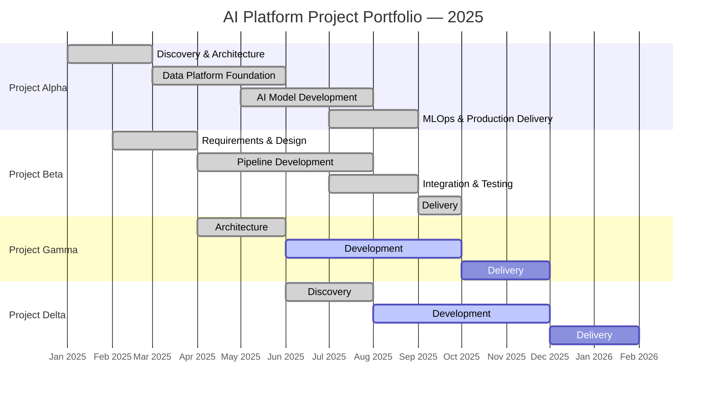

# 05 — Project Portfolio (2025–Present)

Four concurrent AI and Data Engineering projects delivered under the platform. Projects are described at the methodology and outcome level; system-specific details are classified.

---

## Portfolio Overview

---

## Project Alpha — Delivered ✅

**Domain:** Operational intelligence  
**Type:** AI classification + real-time data pipeline  
**Team allocation:** 5 AI Engineers, 3 Data Engineers, 2 MLOps (from platform team)  
**Duration:** 8 months

**Problem:** Operational analysts manually classified and triaged incoming data streams — process took 2–4 hours per cycle with inconsistent results between analysts.

**Solution:** End-to-end pipeline: real-time streaming ingestion → feature engineering → fine-tuned classification model → automated triage with confidence scores → analyst review queue for low-confidence predictions.

**Outcomes:**
- Classification cycle time: 4 hours → 18 minutes (**78% reduction**)
- Analyst time on triage: freed ~60% of analyst capacity for higher-value work
- Model accuracy: 91.2% on hold-out evaluation set
- Data freshness: < 3 minutes from source event to classified output

**MLOps delivery:** Model deployed via ML CI pipeline; model card published; SHAP explanations available per prediction; drift monitoring active.

---

## Project Beta — Delivered ✅

**Domain:** Logistics and resource allocation  
**Type:** Predictive analytics + decision support dashboard  
**Team allocation:** 2 AI Engineers, 3 Data Engineers, 1 Software Engineer, 1 MLOps  
**Duration:** 8 months

**Problem:** Resource allocation decisions were made based on historical averages and manual inspection. No predictive capability; frequent misalignment between resource availability and demand.

**Solution:** dbt-modelled data warehouse consolidating 4 source systems → ensemble forecasting model (XGBoost + LSTM) → FastAPI decision support API → Power BI operational dashboard with 7-day demand forecast and resource gap alerts.

**Outcomes:**
- Forecast accuracy (MAPE): 8.3% (vs. 22% baseline with historical averages)
- Data processing time: **40% reduction** through distributed Spark processing and pipeline optimization
- Decisions using model output: 85% of daily allocation decisions now model-assisted
- Dashboard adoption: 100% of allocation managers using dashboard within 6 weeks of go-live

---

## Project Gamma — In Delivery 🚧

**Domain:** Quality assurance automation  
**Type:** Computer vision + anomaly detection  
**Team allocation:** 3 AI Engineers, 2 Data Engineers, 1 DevOps  
**Status:** Development phase; on track for delivery Month 10

**Problem:** Quality inspection relies on manual visual checks — inconsistent, time-consuming, limited throughput.

**Approach:** Image ingestion pipeline → fine-tuned vision model (custom architecture on domain-specific dataset) → anomaly scoring with confidence threshold → human-review queue for borderline cases → feedback loop for continuous model improvement.

**Current status:** Model training complete, accuracy 94.1% on validation set. CI/CD pipeline green. Staging deployment complete. Production target: Month 10.

---

## Project Delta — Discovery Phase 🔍

**Domain:** Predictive maintenance  
**Type:** Sensor data analytics + time-series forecasting  
**Team allocation:** 2 AI Engineers, 2 Data Engineers  
**Status:** Architecture design; development begins Month 9

**Problem:** Maintenance scheduling is calendar-based, not condition-based. Unplanned failures disrupt operations and cost significantly more than planned maintenance.

**Approach (proposed):** Sensor data streaming pipeline (Kafka) → time-series feature engineering → anomaly detection model (Isolation Forest + LSTM autoencoder) → remaining useful life (RUL) prediction → maintenance scheduling integration.

**Key architectural decision pending:** Edge inference vs. centralised inference for sensor data latency requirements. ADR in progress.

---

## Portfolio Management

### Capacity allocation across projects

| Resource | Alpha | Beta | Gamma | Delta | Platform ops |
|---|---|---|---|---|---|
| AI Engineering (5) | Delivered | Delivered | 3 | 2 | — |
| Data Engineering (4) | Delivered | Delivered | 2 | 2 | — |
| Software Engineering (3) | — | 1 delivered | 1 | — | 2 |
| MLOps / DevOps (3) | Delivered | Delivered | 1 | — | 2 |

### Cross-project risks

| Risk | Projects affected | Mitigation |
|---|---|---|
| Shared MLflow server capacity | All | Horizontal scaling planned for Month 9 |
| Data Engineering capacity (4 people, 2 active projects) | Gamma, Delta | Delta starts development Month 9 when Gamma reaches delivery phase |
| Kafka cluster throughput (Project Delta sensor volumes) | Delta | Capacity assessment in ADR — broker scaling if needed |
